This is a template for Next.js pages router + Mantine.
This template comes with the following features:

    PostCSS with mantine-postcss-preset
    TypeScript
    Storybook
    Jest setup with React Testing Library
    ESLint setup with eslint-config-mantine

La structure actuelle montre que c'est un projet Next.js avec TypeScript, qui utilise déjà des composants et des tests.

Voici une proposition de structure détaillée pour le portfolio :

```mermaid
graph TD
    A[next-pages-portfolio] --> B[pages]
    A --> C[components]
    A --> D[public]
    A --> E[styles]
    A --> F[lib]
    A --> G[types]
    A --> H[data]

    B --> B1[index.tsx - Page d'accueil]
    B --> B2[about.tsx - À propos]
    B --> B3[projects/index.tsx - Projets]
    B --> B4[contact.tsx - Contact]

    C --> C1[layouts/]
    C --> C2[common/]
    C --> C3[sections/]
    C --> C4[ui/]

    C1 --> C1A[MainLayout.tsx]

    C2 --> C2A[Navbar.tsx]
    C2 --> C2B[Footer.tsx]
    C2 --> C2C[SEO.tsx]

    C3 --> C3A[Hero.tsx]
    C3 --> C3B[ProjectsGrid.tsx]
    C3 --> C3C[Skills.tsx]
    C3 --> C3D[Experience.tsx]

    C4 --> C4A[Button.tsx]
    C4 --> C4B[Card.tsx]
    C4 --> C4C[ColorSchemeToggle.tsx]

    D --> D1[images/]
    D --> D2[fonts/]
    D --> D3[icons/]

    E --> E1[globals.css]
    E --> E2[components.css]
    E --> E3[variables.css]

    F --> F1[api.ts]
    F --> F2[utils.ts]
    F --> F3[constants.ts]

    G --> G1[common.types.ts]
    G --> G2[project.types.ts]

    H --> H1[projects.ts]
    H --> H2[experience.ts]
    H --> H3[skills.ts]
```

Voici l'explication détaillée de chaque dossier :

1. **`/pages`**
   - Toutes les routes de l'application
   - Pages principales : accueil, à propos, projets, blog, contact
   - Structure SEO-friendly

2. **`/components`**
   - **`/layouts`** : Templates de mise en page réutilisables
   - **`/common`** : Composants partagés (navbar, footer, etc.)
   - **`/sections`** : Grandes sections de pages (hero, grille de projets, etc.)
   - **`/ui`** : Composants UI réutilisables (boutons, cartes, etc.)

3. **`/public`**
   - **`/images`** : Images optimisées
   - **`/fonts`** : Polices personnalisées
   - **`/icons`** : Icônes SVG

4. **`/styles`**
   - Styles globaux et variables CSS
   - Styles spécifiques aux composants
   - Thèmes et variables

5. **`/lib`**
   - Utilitaires et helpers
   - Configuration d'API
   - Constants et configurations

6. **`/types`**
   - Définitions TypeScript
   - Interfaces et types partagés

7. **`/data`**
   - Données statiques (projets, expériences, compétences)
   - Configuration du contenu

Améliorations recommandées pour la structure actuelle :

1. **Organisation modulaire** : Séparer les composants par domaine fonctionnel
2. **Performance** : Utiliser des images optimisées et le chargement lazy
3. **Maintenabilité** : Structure claire pour les tests et la documentation
4. **SEO** : Components dédiés pour le référencement
5. **Réutilisabilité** : Composants UI standardisés

Cette structure suit les meilleures pratiques Next.js tout en facilitant la maintenance et l'évolution du portfolio.

Je propose la structure suivante pour le portfolio, basée sur la configuration Next.js existante :

Structure des dossiers :
1. `/pages`
   - index.tsx (Accueil)
   - about.tsx (À propos)
   - projects/index.tsx (Projets)
   - contact.tsx (Contact)

2. `/components`
   - /layouts
     - MainLayout.tsx
     - BlogLayout.tsx
   - /common
     - Navbar.tsx
     - Footer.tsx
     - SEO.tsx
   - /sections
     - Hero.tsx
     - ProjectsGrid.tsx
     - Skills.tsx
     - Experience.tsx
   - /ui
     - Button.tsx
     - Card.tsx
	 - VerticalTimeline.tsx
     - ColorSchemeToggle.tsx (déjà existant)

3. `/public`
   - /images
   - /fonts
   - /icons
   - favicon.svg (déjà existant)

4. `/styles`
   - globals.css
   - components.css
   - variables.css

5. `/lib`
   - api.ts
   - utils.ts
   - constants.ts

6. `/types`
   - common.types.ts
   - project.types.ts

7. `/data`
   - projects.ts
   - experience.ts
   - skills.ts

Cette structure s'appuie sur vos fichiers existants tout en ajoutant une organisation modulaire pour une meilleure maintenabilité et évolutivité. Elle suit les meilleures pratiques Next.js et facilite l'implémentation de fonctionnalités avancées comme le SEO, la performance et l'accessibilité.